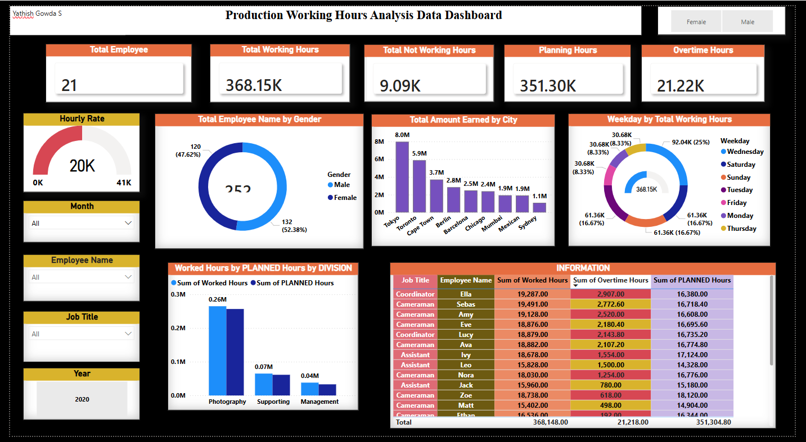

# 📊 Production Working Hours Analysis Dashboard

## 📌 Overview
This project presents an interactive Power BI dashboard built using a Production Working Hours dataset. The dashboard provides insights into employee productivity, working patterns, and workforce utilization through KPIs, slicers, and visual analytics.

---

## 🎯 Objective
The goal of this dashboard is to:
- Analyze working vs planning vs overtime hours
- Track employee distribution and productivity
- Enable dynamic filtering by time, role, and demographics
- Provide actionable insights for operational efficiency

---

## 📂 Dataset
The dataset is an Excel file containing employee-level production data with fields such as:
- Employee Name  
- Job Title  
- City  
- Gender  
- Division  
- Starting Date / Ending Date  
- Working Hours  
- Planning Hours  
- Non-Working Hours  
- Overtime Hours  
- Amount Earned / Budget  

---

## ⚙️ Data Preparation (Power Query)

### Steps performed:
- Imported Excel data into Power BI
- Removed blank/null rows
- Replaced null values in numeric columns with 0
- Converted data types appropriately
- Created Weekday column:

```DAX
Weekday = FORMAT('Table'[Starting Date], "DDDD")
```

- Extracted:
  - Year
  - Month

---

## 🧮 Measures Created

```DAX
Total Employees = DISTINCTCOUNT('Table'[Employee Name])

Total Working Hours = SUM('Table'[Working Hours])

Non-Working Hours = SUM('Table'[Non-Working Hours])

Planning Hours = SUM('Table'[Planning Hours])

Overtime Hours = SUM('Table'[Overtime Hours])
```

---

## 🧩 Dashboard Components

### 🏷️ Title
Production Working Hours Analysis Dashboard  
- Font: 24  
- Bold and Centered  
- Styled with shadow/background  

---

### 📌 KPI Cards
- Total Employees  
- Total Working Hours  
- Non-Working Hours  
- Planning Hours  
- Overtime Hours  

Features:
- Custom colors  
- Borders & shadows  
- Titles enabled  

---

### 🎛️ Slicers (Filters)
- Month  
- Year  
- Employee Name  
- Job Title  
- Gender  

Features:
- Dropdown style  
- No headers  
- Interactive filtering  

---

### 📊 Visualizations

1. Donut Chart – Employees by Gender  
2. Clustered Column Chart – Amount Earned by City  
3. Donut Chart – Working Hours by Weekday  
4. Clustered Column Chart – Working Hours & Planning Hours by Division  
5. Table View:
   - Job Title  
   - Employee Name  
   - Working Hours  
   - Planning Hours  
   - Non-Working Hours  
   - Overtime Hours  
   - Starting Date  
   - Ending Date  
   - Conditional formatting (data bars)

---

## 🖼️ Dashboard Preview



## 🔍 Key Insights
- Overtime is higher in certain divisions  
- Some weekdays show lower productivity vs planning  
- Gender distribution varies across job roles  
- Gap between planning and actual hours highlights inefficiencies  

---

## ⚠️ Challenges Faced
- Handling date formatting for weekday extraction  
- Managing null values in dataset  
- Applying conditional formatting  
- Maintaining consistent dashboard theme  

---

## 💾 File
ProductionHoursAnalysisDashboard.pbix

---

## 🚀 How to Use
1. Open the .pbix file in Power BI Desktop  
2. Use slicers to filter data  
3. Hover over visuals for detailed insights  
4. Explore trends across divisions, cities, and time  

---
